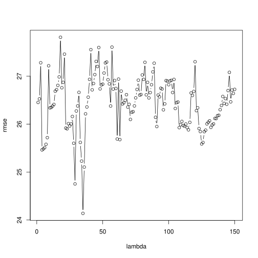

## Intro

Even if this isn't used for the caribou study, I was really interested in whether I could implement lasso regression with a general linear mixed model. The only workable implementation in R I could find is the `glmmLasso` package. Even though the package is still on CRAN, it is not compatible with R 4.0. So I had to run this code on a rolled-back version of R (R 3.6.2). The "new R server" that SESYNC is going to switch to soon actually will have a bunch of older versions of R installed that you can choose from.

Here I am going to work through doing the lasso regression as a form of variable selection for one of the caribou herds, using year as a random effect and all the potential predictors as fixed effects. The lasso regression can shrink some of the predictors to zero. It also shrinks some of the other predictors toward zero even if they do not quite hit zero. It has a tuning parameter $\lambda$ that you have to specify. The bigger the value of $\lambda$, the bigger the penalty so the more variables are excluded. But that means a smaller $\lambda$ value is always a tighter fit to the data used to fit the model. So instead of using information criteria to pick a good intermediate value, we have to use cross-validation to hold some of the data back and predict on those new values that weren't used to fit the model. In that case, there will be a $\lambda$ value that strikes a balance between excluding variables and being a good fit to the data. 

I made a big list of lambdas and used cross-validation on each one. The cross-validation loops through the years, each time holding back one year of data as test data. The model is fit to all other years and used to predict the missing year. That way, we can see how well the model does at predicting the unseen values, for each $\lambda$. If this was done at a big scale I would have to run this computation in parallel.

## Make the data

This creates the data frame and subsets it to only one herd, Western Arctic.


```r
load('~/temp/finalDF.rda')

library(glmmLasso)
library(dplyr)
library(stringr)

df2 = finalDF

xvars <- c('tmean_insect' , 'prcp_insect' , 'windspeed_insect' ,
           'ndays.hightemp_insect' , 'ndays.lowwind_insect' ,
           'tmean_summer' , 'prcp_summer' , 'windspeed_summer' ,
           'tmean_fall' , 'prcp_fall' , 'windspeed_fall' ,
           'tmean_winter' , 'prcp_winter' , 'windspeed_winter' ,
           'tmean_spring' , 'prcp_spring' , 'windspeed_spring' ,
           'tmean_migration' , 'prcp_migration' , 'windspeed_migration')

colnames(df2)[which(colnames(df2) %in% colnames(df2 %>% dplyr::select(ends_with('early summer'))))] <-
  str_replace(colnames(df2 %>% dplyr::select(ends_with('early summer'))),'early summer','insect')
colnames(df2)[which(colnames(df2) %in% colnames(df2 %>% dplyr::select(ends_with('late summer'))))] <-
  str_replace(colnames(df2 %>% dplyr::select(ends_with('late summer'))),'late summer','summer')
colnames(df2)
```

```
##  [1] "herd"                  "Year"                  "ID_Year"              
##  [4] "ID"                    "Best.Model"            "calving.date"         
##  [7] "Recovery"              "calving.date.score"    "calving.day"          
## [10] "grouped_herd"          "x"                     "y"                    
## [13] "lon"                   "lat"                   "tmax_insect"          
## [16] "tmin_insect"           "tmean_insect"          "prcp_insect"          
## [19] "ndays.hightemp_insect" "windspeed_insect"      "ndays.lowwind_insect" 
## [22] "tmax_summer"           "tmin_summer"           "tmean_summer"         
## [25] "prcp_summer"           "windspeed_summer"      "tmax_fall"            
## [28] "tmin_fall"             "tmean_fall"            "prcp_fall"            
## [31] "windspeed_fall"        "tmax_winter"           "tmin_winter"          
## [34] "tmean_winter"          "prcp_winter"           "windspeed_winter"     
## [37] "tmax_spring"           "tmin_spring"           "tmean_spring"         
## [40] "prcp_spring"           "windspeed_spring"      "tmax_migration"       
## [43] "tmin_migration"        "tmean_migration"       "prcp_migration"       
## [46] "windspeed_migration"   "crossing.day95"        "crossing.day50"       
## [49] "calving.lag95"         "calving.lag50"         "calving.core"         
## [52] "calving.peripheral"    "calving.location"      "peak"                 
## [55] "n"                     "calving.deviation"
```

```r
df2 <- df2 %>% dplyr::select(!starts_with('tmax') &! starts_with('tmin'))
getDev <- function(x) x - median(x, na.rm = TRUE)
df2 <- df2 %>% group_by(herd) %>% mutate(calving.deviation = getDev(calving.day))
getScaleDF <- function(df, myherd){
  newdf <- droplevels(na.omit(subset(df, herd == myherd)))
  scaled.covars <- as.data.frame(scale(newdf[,c(15:34)]))
  newdf <- droplevels(na.omit(cbind(as.data.frame(newdf[,c('ID_Year','ID','herd','Year', 'calving.day', 'calving.deviation')]), scaled.covars)))
  return(newdf)
}

df2$Year <- factor(df2$Year)

df.scaled <- getScaleDF(df2, myherd = 'Western Arctic')
```

## Fit the model

### Set up the model formula

We set up the model formula with all the predictors and make a vector of $\lambda$ values to try out.


```r
full_formula <- formula(paste("calving.day ~", paste(xvars, collapse = "+")))

lambdas <- 1:150

years <- levels(df.scaled$Year)
```

### Define a function for cross-validation

This function does cross-validation given a particular $\lambda$ value and calculates the root mean squared error (RMSE).


```r
cvrmse <- function(lambda) {
  err <- c()
  for (y in years) {
    dat_train <- df.scaled[!(df.scaled$Year %in% y), ]
    dat_test <- df.scaled[df.scaled$Year %in% y, ]
    fit <- glmmLasso(fix = full_formula, 
              rnd = list(Year = ~ 1),
              data = dat_train,
              lambda = lambda)
    pred <- predict(fit, newdata = dat_test)
    err <- c(err, pred - dat_test$calving.day)
  }
  rmse <- sqrt(mean(err^2))
  message(paste('Completed lambda =', lambda))
  return(rmse)
}
```

### Do the CV

Do cross-validation for many tuning parameter values.


```r
rmses <- sapply(lambdas, cvrmse)

cv_dat <- data.frame(lambda = lambdas, rmse = rmses)

write.csv(cv_dat, 'cv_rmse.csv', row.names = FALSE)
```

## Look at the results

What is the trend of RMSE?


```r
with(cv_dat, plot(lambda, rmse, type = 'b'))
```



The best lambda is the one that minimizes RMSE. Fit to the full dataset.


```r
# The final lambda is the one that minimizes RMSE
(lambda_best <- lambdas[which.min(rmses)])
```

```
## [1] 35
```

```r
# The final fit uses that lambda.
fit_final <- glmmLasso(fix = full_formula, 
                 rnd = list(Year = ~ 1),
                 data = df.scaled,
                 lambda = lambda_best)
```

Look at which coefficients are included and excluded.


```r
fit_final$coefficients
```

```
##           (Intercept)          tmean_insect           prcp_insect 
##          132.85607369           -0.89978027           -0.06426539 
##      windspeed_insect ndays.hightemp_insect  ndays.lowwind_insect 
##            0.17716897            0.04889829           -0.47429640 
##          tmean_summer           prcp_summer      windspeed_summer 
##            0.13343293           -0.11592584            0.18494516 
##            tmean_fall             prcp_fall        windspeed_fall 
##            0.11086218           -0.82534375            0.73011739 
##          tmean_winter           prcp_winter      windspeed_winter 
##           -0.24187880           -0.72257709            0.33891413 
##          tmean_spring           prcp_spring      windspeed_spring 
##            0.00000000           -0.43182039            0.59243565 
##       tmean_migration        prcp_migration   windspeed_migration 
##            0.01624133           -0.25020881           -0.78546395
```

```r
# Included
names(fit_final$coefficients)[abs(fit_final$coefficients) > 0]
```

```
##  [1] "(Intercept)"           "tmean_insect"          "prcp_insect"          
##  [4] "windspeed_insect"      "ndays.hightemp_insect" "ndays.lowwind_insect" 
##  [7] "tmean_summer"          "prcp_summer"           "windspeed_summer"     
## [10] "tmean_fall"            "prcp_fall"             "windspeed_fall"       
## [13] "tmean_winter"          "prcp_winter"           "windspeed_winter"     
## [16] "prcp_spring"           "windspeed_spring"      "tmean_migration"      
## [19] "prcp_migration"        "windspeed_migration"
```

```r
# Excluded
names(fit_final$coefficients)[fit_final$coefficients == 0]
```

```
## [1] "tmean_spring"
```

