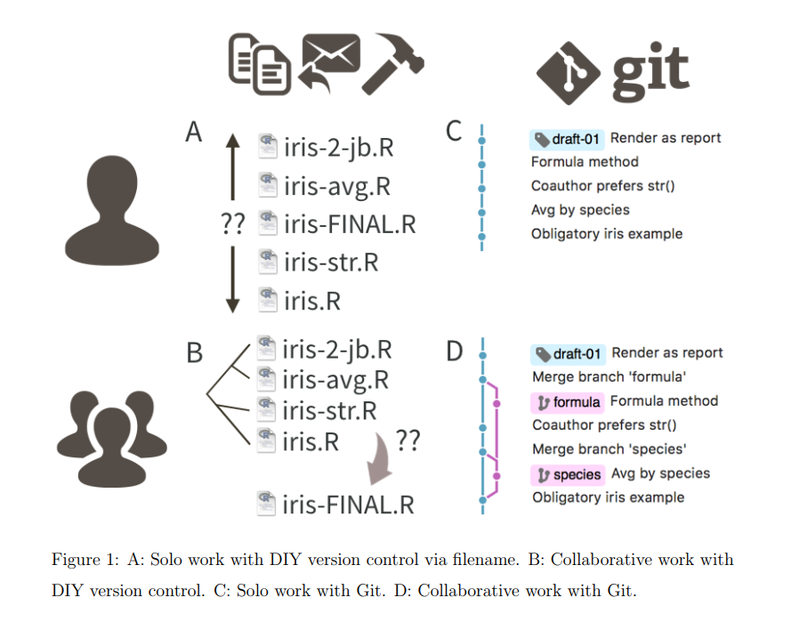
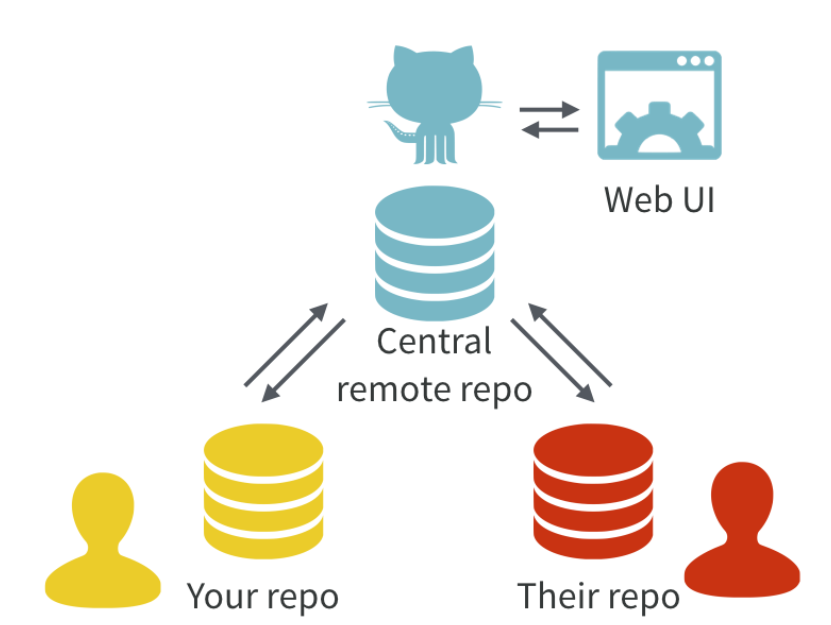
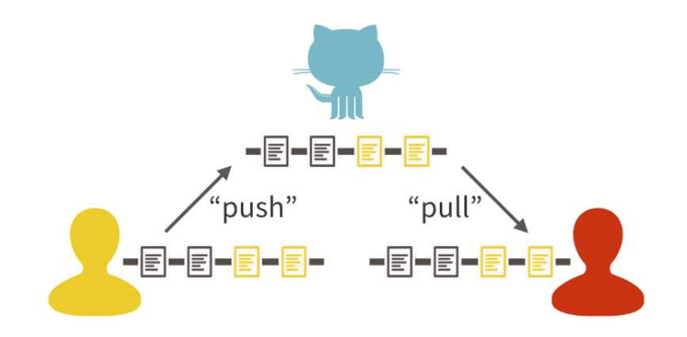
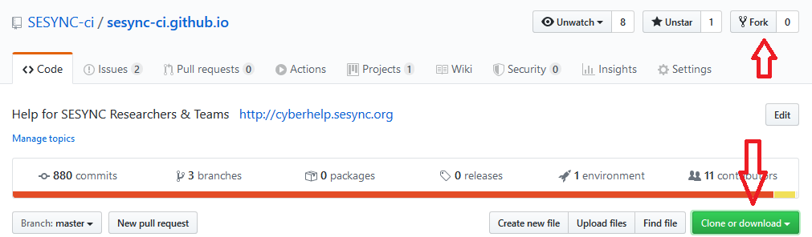
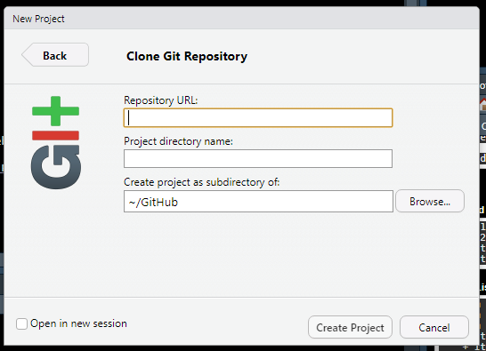
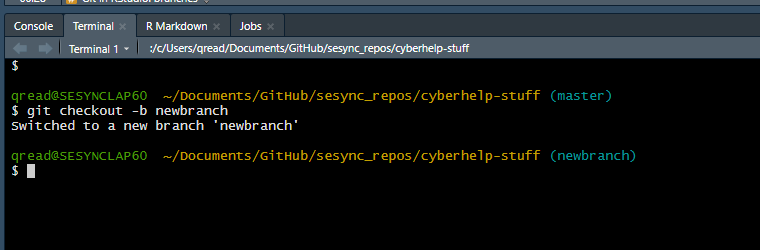

```{r setup, include=FALSE}
knitr::opts_chunk$set(echo = FALSE)
```

## Goals for today

- Discuss the rationale behind using version control and a few possible use cases
- Share experiences, good and bad
- Explore using Git integration in RStudio
- Show some examples from Quentin's work and from the SESYNC-CI GitHub

## Why use it? or better, why not use it?

- Everyone uses version control -- this is a way to formalize it 

{height=75%}

## Why use it? or better, why not use it?

- Project management
- It is your project's web presence, and part of your personal web presence
- In some fields it is almost an expectation that you will have an active GitHub site
- Part of a suite of open science tools 

## Arguments against

- It does take some buy-in from everyone participating
- (perceived to have) a steep learning curve

## Stories?

- Does anyone have any good stories or horror stories?

## Use cases

During

- use it solo to organize your work
- multiple team members can contribute to a repository simultaneously

After

- publish a repository to the web (for open/reproducible science)
  + *Note*: this may require ongoing maintenance!

## How it works

{height=80%}

- git vs GitHub vs GitLab?
- What's a repo(sitory)?

## Pulling and pushing



## Forking and cloning



## Git in RStudio: creating a project

- RStudio uses "projects" to organize your work
  + projects correspond to repos

{height=75%}

## Git in RStudio: pull before new work!


## Git in RStudio: committing changes


## Git in RStudio: branches

- Creating new branches must be done through the terminal or on the GitHub website



## Example: Q's personal GitHub

- <https://github.com/qdread>
  + **DISCLAIMER**: this does not entirely embody best practices!!!
  
{height=50%}

## Example: SESYNC Cyberinfrastructure GitHub

- <https://github.com/sesync-ci/>
  + [Project containing all lessons in curriculum](https://github.com/orgs/SESYNC-ci/projects/2) -- good demonstration of project management
  + [rslurm package](https://github.com/SESYNC-ci/rslurm) -- note the issues and pull requests 
  
## (Semi)-advanced topic: issues and pull requests

- Can be used either internally or externally
  + Internally to track tasks for project management
  + Externally for community members to contribute to your project

## SESYNC resources

- [basic git lesson](http://cyberhelp.sesync.org/basic-git-lesson/)
- [all quick start, FAQ, and help pages tagged with git](https://cyberhelp.sesync.org/tags.html?with=git)
- [document with resources on learning GitHub Pages](https://github.com/SESYNC-ci/sesync-ci.github.io/blob/master/blog/_drafts/github-pages-resources.md) -- this is still a draft in progress!

## Outside resources

- [Using zenodo to get a DOI for your published git repository](https://guides.github.com/activities/citable-code/)
- [Hadley Wickham's book on packages](http://r-pkgs.had.co.nz/)
- [Excuse me, do you have a moment to talk about version control?](https://peerj.com/preprints/3159/) Excellent paper by Jenny Bryan, which I shamelessly copied from for this presentation


